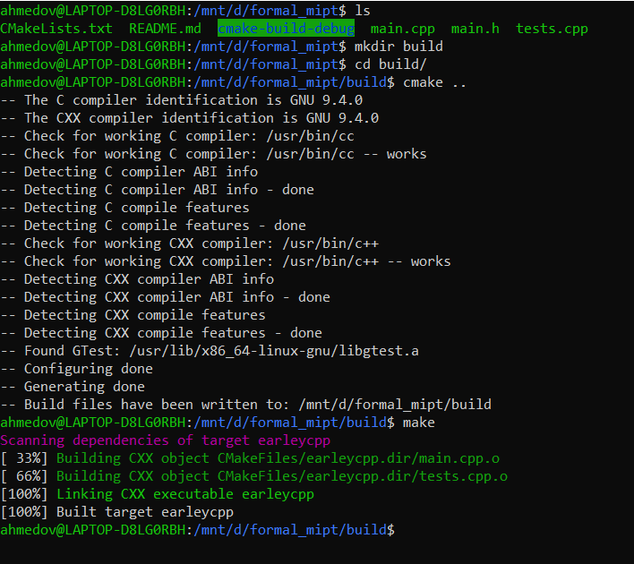
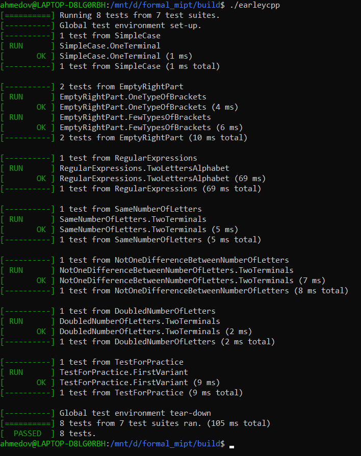
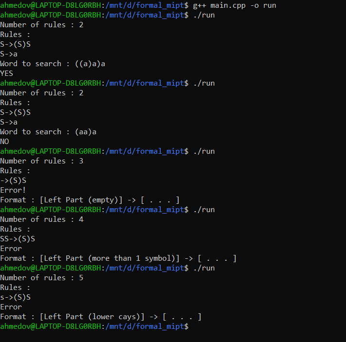

# Алгоритм Эрли 
## Проверки принадлежности слова контекстно-свободной грамматике

### Как это запустить?

+ **Клонировать репозиторий с github:**
```bash
git clone https://github.com/amonulloh/Formal-Practice2-MIPT/tree/earley_algorithm
```
+ **Настроить CMakeLists.txt:**
+ **Локальное тестирование:**
 ```bash
 g++ main.cpp -o run
 ./run
 ```
+ **Полное тестирование:**
 Сначала нужно комментировать функцию main в main.cpp затем:
 ```bash
 mkdir build
 cd build
 cmake ..
 make
 ./earleycpp
 ```

### Тестирования:


Полное тестирование.



Локальное тестирование.


***Проект написано для курса "Формальные Языки и Трансляции"*** </br >
***Лектор: Ахтямов Павел Ибрагимович*** </br>
***Семинарист: Ахтямов Павел Ибрагимович*** </br>
***Автор: Ахмедов Амонуллохон Хусейнович, ФПМИ Б05-152*** </br>
